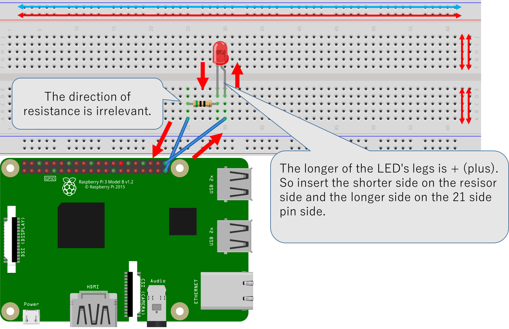
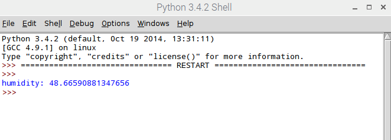
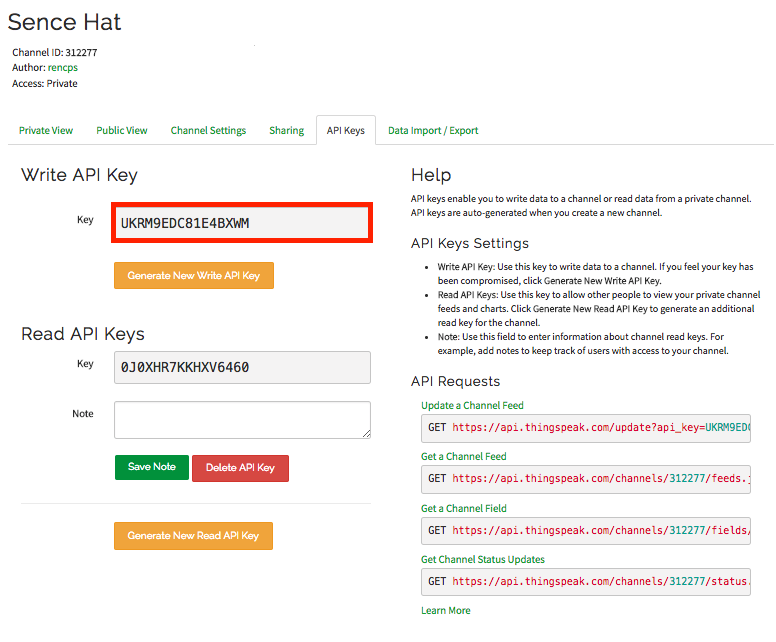

# Sensing base and control programming
## About Sense Hat
The Sense Hat is an add-on board with various sensors and LEDs.
Sensors included in the Sense Hat are as follows.
- Gyroscope
- Accelerometer
- Magnetometer
- Temperature
- Barometric pressure
- Humidity

There is also a Python Library that gives easy access to everything on the board.

## About Python
Python is a dynamic typed programming language used in various applications. It is widely used in various fields such as machine learning, statistical analysis, sensor control.
Python has the following features.
- Easy to learn.
- Blocks are indicated by the number of indents.
- It is a dynamic typed language in which all integers and character strings are also as objects.
- Many libraries available for scientific computing and machine learning are prepared.
- The implementation of Python is available as an open source license that you can freely use, freely distribute, and can also use for commercial use.
etc.

## Python Tutorial
1. Open Python Shell
[Menu]→[Programming]→[Python3(IDLE)]
2. Write a code.
  

## Let's light the LED
- Things to prepare
bread board, 50Ω Resistor, LED, Jumper wire
  1. Connect as shown.
  
  ↑Raspberry Pi3's pin assignment.

    <font color="OrangeRed">※Bread board is the substrate used for prototyping, experimentation, evaluation. An electric signal flows in the direction of the arrow line in the following figure.</font>
  This time connect to GPIO21 and GND.
  

  2. Open Python3 IDLE [Menu]→[Programming]→[Python3(IDLE)]→[File]→[New File]

  3. Write the following code.

  ```
  import RPi.GPIO as GPIO
  import time

  GPIO.cleanup()
  GPIO.setmode(GPIO.BCM)
  GPIO.setup(21, GPIO.OUT)
  while True:
  GPIO.output(21, GPIO.HIGH)
  time.sleep(1)
  GPIO.output(21, GPIO.LOW)
  time.sleep(1)
  ```
  4. [Run]→[Run Module] or push F5 key on keyboard.
    ※Warnings may be issued, but if the LEDs are blinking, you can ignore this time.

## Running The Sense Hat Emulator
1. Open Raspberry Pi Configuration
[Menu]→[Programming]→[Sense Hat Emulator]

2. Open Sample Code. (about humidity.py)
[File]→[Open example]→[Simple]→[humidity.py]

3. Run humidity.py
[Run]→[Run Module] or Press the F5 key.

4. Result screen

By changing the value by raising or lowering the Humidity bar, how the LEDs shine also changes.

※If you want to run with the real Sense Hat, change `from sense_emu import SenseHat` on program to `from sense_hat import SenseHat`.


## Obtaining values of sensor data
As an example, let's get the value of the humidity sensor.
1. Open Python3 IDLE [Menu]→[Programming]→[Python3(IDLE)]→[File]→[New File]
2. Writing program. And run the program with [Run]→[Run Module].

3. Humidity value is displayed on Shell.

※Refer to Sense Hat official document for how to get the values of other sensors, so please see.

## about ThingSpeak
ThingSpeak is one of the IoT Platforms.
As a similar platform there are Kibana and Milkcocoa. These platforms can accumulate, analyze, and visualize data.

### Sign up ThingSpeak
1. Open sign up page from ThingSpeak's homepage.
<https://thingspeak.com/users/sign_up>
 
2. Follow the instructions to create an account.

### Send sensor data to ThingSpeak.
1. Login to ThingSpeak.
2. Click to Channels on Menu tab. And push [New Channel] button.
 
3. Open [API Keys] tab. And confirm API key.
 
4. Open Python3 IDLE on raspberry pi and open [File] tab → [New file].
5. Write the following code. Insert the Write API Key confirmed above into the Write_API_KEY below.
  ```
  from sense_hat import SenseHat
  import urllib.parse
  import urllib.request
  import time

  sleep = 15 #Send a value every 15 seconds
  key = "Write_API_KEY" #This White_API_KEY is your API Key
  sense = SenseHat()
  def send_data():
      while True:
          humidity = sense.get_humidity()
          params = urllib.parse.urlencode({'Key': key, 'field1': humidity})
          url = 'https://api.thingspeak.com/update?' + params
          try:
              f = urllib.request.urlopen(url)
          except:
              print("connection failed")
          break

  if __name__ == "__main__": #two "_"
      while True:
          send_data()
          time.sleep(sleep)
  ```
6. Set and save the file name.
7. [Run]　→　[Run Module] or push F5 key.
8. Confirm Private view on ThingSpeak.
 You can see that the current humidity is plotted.
 

## Work
Let's try other sensor data obtained by Sense Hat.

### Raspberry pi's pin assignment
<https://www.raspberrypi.org/documentation/usage/gpio-plus-and-raspi2/>
### Python tutorial
<https://docs.python.org/3.6/tutorial/index.html#the-python-tutorial>
### Sense Hat official document
<https://pythonhosted.org/sense-hat/api/#sense-hat-api-reference>
### ThingSpeak tutorial
<https://jp.mathworks.com/help/thingspeak/update-channel-feed.html>
