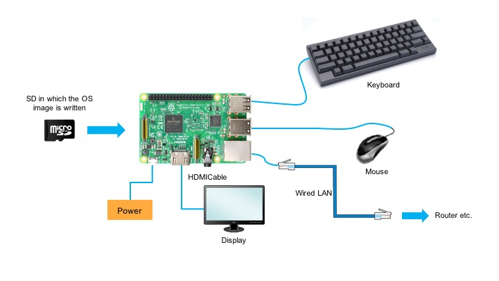
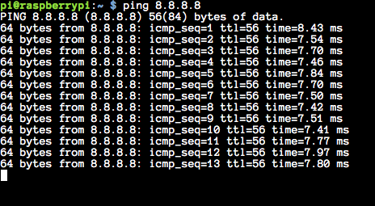
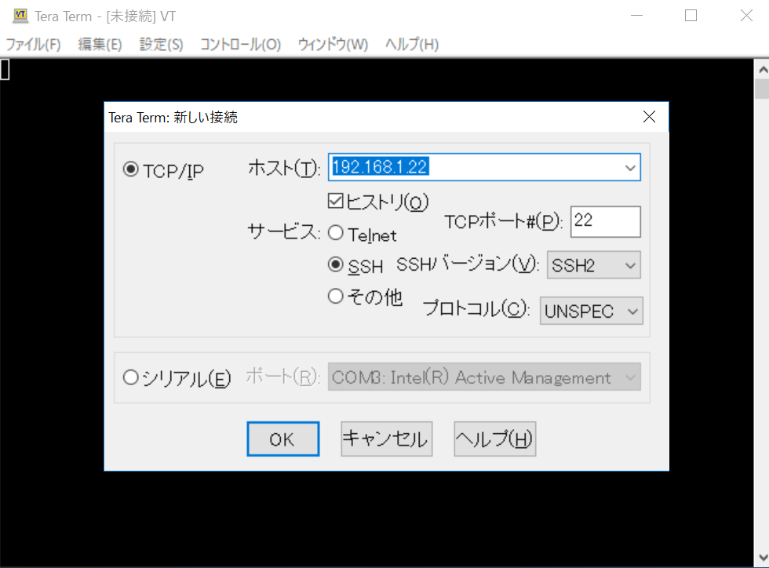
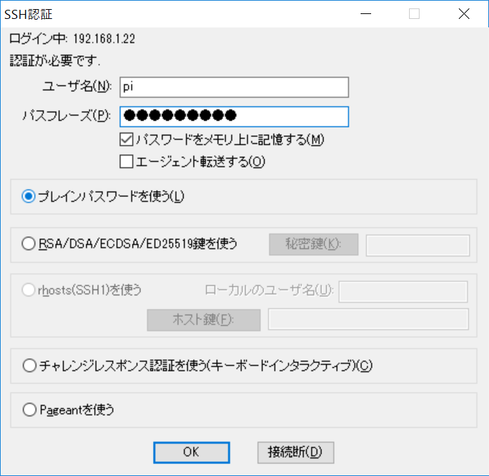
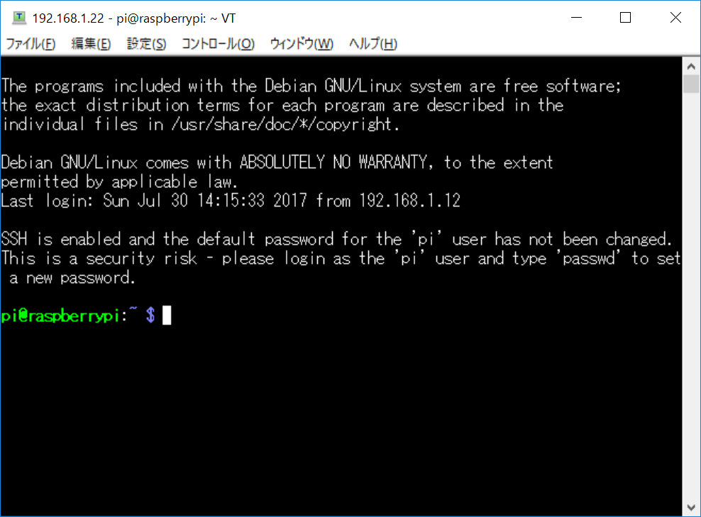

# Raspberry Pi Tutorial
This document for people who first touches Raspberry Pi.

# What's Raspberry Pi
Raspberry Pi is single board computer designed for education. This computer has characteristics that it can be obtained cheaply and is compact.

## What it can do?
1. It can be used as a desktop environment client computer.
2. It can be used as a power saving server.
3. It can control electronic circuit.
4. It can study programming.

## Spec
||Pi ModelB+|Pi2 ModelB|Pi3 ModelB|
|:--:|:--:|:--:|:--:|
|price|$25|$35|$35|
|CPU|single-core 700MHZ|quad-core 900MHz|quad-core 1.2GHz|
|memory|512MB|1GB|1GB|
|power consumption|600mA|900mA|7W|

# Let's start Raspberry Pi
## Connection

- Connect HDMI port and display using HDMI cable.
- Connect the mouse and keyboard to the USB port.
- Connect the LAN cable to the LANport.

## Shutdown or reboot
Open the menu at the top.(Mark of Raspberry Pi) → select [Shutdown]

## Initialization
### Setting the resolution
If it is expanded and displayed, it is necessary to change the resolution.

  1. Open Raspberry Pi Configuration
[Menu]→[Preference]→[Raspberry Pi Configuration]
  2. Press [Set Resolution] button in [Resolution] of [System] tab.
  3. Select [Default Preferred monitor settings].

<!-- - Using CLI
  1. Open LXTerminal on the task bar.
  2. Enter `vi  /boot/config.txt` and open the resolution setting file.
  3. Set the value of hdmi_group and the value of hdmi_mode.
  `hdmi_mode=2
   hdmi_group=82`
  4. Close setting file.
  5. Enter `reboot`. -->
### Change from US keyboard setting to JIS keyboard setting
  1. Menu → [Preferences] → [keyboard and Mouse]. Open Mouse and keyboard Settings.
  2. Select [keyboard] tab. And push [Keyboard Layout] button. 　
  3. Country chooses Japan. And Variant chooses Japanese.

### Confirm network connection
  1. Open Terminal in the upper Menu
  2. Enter the following command

      ```
      ping 8.8.8.8
      ```

  ※ The ip address 8.8.8.8 is the google public DNS ip address.
  3. If ping is passed, the following display will appear.
    
  4. Press ctrl + c to stop ping.

### Setting up SSH connection
  1. Open Raspberry Pi Configuration
[Menu]→[Preference]→[Raspberry Pi Configuration]
  2. Check [Enable] button in [SSH] of [Interfaces] tab.
  3. Attempt SSH connection from client PC.
    - For Windows
      1. Open LXTerminal on the task bar.
      2. Enter `ifconfig` and check the IP address of [inet addr] of [eth0].
      3. Open [Tera Term] on Windows. Enter the IP address in the host field and check SSH.
        
      4. Enter user name and passphrase(default user name is "pi" and passphrase is "raspberry")
        
      5. Complete SSH connection.
        
    - for Mac
      1. Open LXTerminal on the task bar.
      2. Enter `ifconfig` and check the IP address of [inet addr] of [eth0].
      3. Open Terminal on Mac.
      4. Enter `ssh pi@[IP address]`
      5. Enter password(default passphrase is "raspberry")
      6. Complete ssh connection.

<!-- ### Update packages
  1. Open LXTerminal on the task bar.
  2. Enter `sudo apt-get update`
  3. Enter `sudo apt-get upgrade -y` -->

### Raspberry Pi official homepage
<https://www.raspberrypi.org/>
